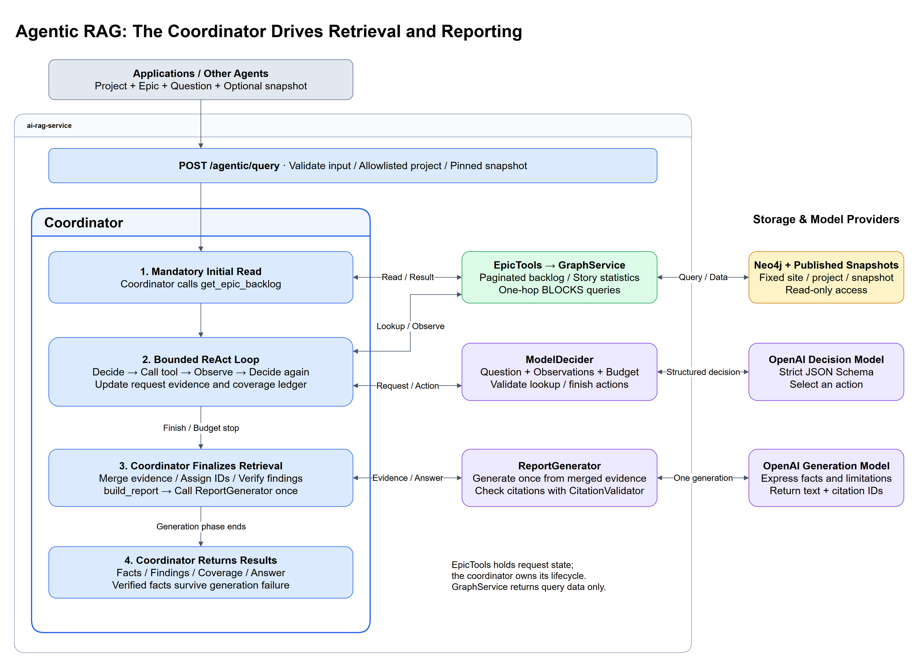

# AI RAG Service

A RAG (Retrieval-Augmented Generation) service for ingesting data from Jira, Confluence, Market Data (FX), and PDF files, using OpenAI and ChromaDB.

All remote model calls now require explicit AI Gateway configuration, including
ingestion/query embeddings, generation, reranking, Graph builds and evaluation
scripts. See [Gateway migration and verification](docs/guides/ai-gateway-migration.md).
The runtime no longer reads provider `OPENAI_API_KEY` / `OPENAI_BASE_URL`.

## Architecture overview


Indexing, Hybrid/Graph retrieval, grounded answers, coordinator-driven Agentic
Epic analysis, and the optional query embedding cache.

[Full-size architecture image](docs/illustrations/hybrid-grounded-rag-poc-architecture.drawio.png) ·
[Editable Draw.io source](docs/illustrations/hybrid-grounded-rag-poc-architecture.drawio)

## 🚀 GKE Deployment

The service is deployed to Google Kubernetes Engine (GKE).

- **Base URL:** `http://34.10.130.210`
- **Swagger UI:** `http://34.10.130.210/docs`
- **Redoc UI:** `http://34.10.130.210/redoc`
- **Health Check:** `http://34.10.130.210/health`

## 🛠 Tech Stack

- **Framework:** FastAPI
- **LLM:** OpenAI GPT-5.5 pinned snapshot (`gpt-5.5-2026-04-23`)
- **Embedding Model:** OpenAI text-embedding-3-small
- **Vector DB:** ChromaDB (Persistent storage on GKE PVC)
- **Keyword index:** SQLite FTS5
- **Graph DB:** Neo4j (optional local Graph RAG PoC)
- **Cloud:** Google Cloud Platform (GKE, Artifact Registry, Cloud Build)
- **Parsing:** PyMuPDF, Atlassian Python API

Optional [query embedding cache experiment](docs/guides/query-embedding-cache.md):
process-local exact-input LRU + TTL for Vector/Hybrid and Graph query vectors,
disabled by default (`QUERY_EMBEDDING_CACHE_ENABLED=true` to enable).

### Model Responsibilities and Integration Modes

- `POST /agentic/query` provides optional Epic analysis through a bounded ReAct
  coordinator: it selects structural dependency lookups, verifies coverage and
  findings, and generates one final report. Enable both `GRAPH_ENABLED` and
  `AGENTIC_RAG_ENABLED`. This path does not call the embedding model.

- `text-embedding-3-small` converts document chunks and user queries into
  vectors for similarity search in ChromaDB. It does not generate answers.
- `POST /query` provides an end-to-end RAG flow: this service retrieves the
  relevant context and uses its configured pinned GPT-5.5 model to generate the final
  answer.
- `POST /retrieve` provides retrieval only: it returns the relevant chunks and
  metadata without calling the answer model. AI applications that
  already have their own configured LLM should normally use this endpoint and
  pass the retrieved context to their own LLM.

For example, if `ai-market-studio` already defines its own LLM, the recommended
integration is to call `/retrieve` and let that LLM generate the final answer.
Use `/query` when the caller wants this RAG service to own both retrieval and
answer generation with its pinned GPT-5.5 model.

## Hybrid retrieval, reranking, and grounding

New to RAG? Start with the beginner-friendly
[RAG Pipeline Fundamentals](docs/guides/rag-pipeline-fundamentals.md) guide for
the concepts behind chunking, tokenization, FTS5/BM25, embeddings, dual
indexing, RRF, and query decomposition.

The default `RETRIEVAL_MODE=hybrid` combines SQLite FTS/BM25-style lexical
retrieval with Chroma vector retrieval using reciprocal-rank fusion (RRF). The
candidate and final limits default to 30 and 10 respectively, with
`RETRIEVAL_RRF_K=60`; lexical field weights default to 10 (Jira key), 5
(title), and 1 (content). `JIRA_KEY_PATTERN` defaults to
`\b[A-Z][A-Z0-9]+-\d+\b`; `RETRIEVAL_SCORE_THRESHOLD` is empty/disabled by
default. `vector` and `lexical` remain supported safe
retrieval modes; if one hybrid backend is unavailable, the pipeline uses the
available backend and records a bounded diagnostic. If all configured primary
retrieval backends fail, retrieval fails rather than inventing an answer.

Existing Chroma-only data must be reindexed to build `lexical.db` before
lexical or hybrid retrieval can find it. Re-run the normal document ingestion
for the corpus after enabling lexical retrieval; do not treat the pre-existing
Chroma collection as a lexical index.

`RERANKER_PROVIDER=none` is the safe default. `openai` selects the pinned
`RERANKER_OPENAI_MODEL=gpt-5.5-2026-04-23` with a five-second timeout;
`qwen_local` selects the pinned
`Qwen/Qwen3-Reranker-0.6B` revision. Both rerankers are bounded to a small
candidate list (Qwen: 20 candidates, 512 tokens, batch size 4, five-second
timeout, 30-second circuit-breaker) and safely fall back to the RRF order on
failure. The local Qwen path is optional: install `requirements-qwen.txt` only
on the operator host that will run it. Grounded answers select 5–10 evidence
items (default 5), cap prompt content at 4,000 characters and excerpts at 200,
and will refuse when evidence is insufficient; retrieval alone cannot guarantee
that a generated answer is correct. Answer generation uses the pinned
`ANSWER_OPENAI_MODEL=gpt-5.5-2026-04-23` with a 15-second timeout.

## Repeatable evaluation

The evaluation harness compares exactly these configurations: A vector only;
B BM25 + vector + RRF; C1 B's cached candidates with the pinned GPT-5
reranker; and C2 those same cached B candidates with the pinned Qwen reranker.
For each question, C1 and C2 receive independent deep copies of the identical
B ordering, so neither reranker can alter the other's input. Evaluation B
disables supplementary exact Jira lookup and marks a case failed if either
primary backend degrades, rather than misreporting a single-backend result as
hybrid. A, B, C1, and C2 retain/rank a comparable top-20 pool, so Recall@20 is
evaluated at the same depth for every configuration.

`evaluation/cases.example.jsonl` contains only synthetic placeholder cases
(exact fact, cross-document, hard negative, and unanswerable). It is a schema
example, not a measured corpus or a source of real Jira, Confluence, or PDF
labels. Start with roughly 30 manually labelled cases. Document-level labels
are sufficient initially; add chunk IDs only when refinement is useful.

Run an evaluation from an environment configured for the service:

```powershell
python -m app.evaluation.runner --cases evaluation/cases.example.jsonl --output evaluation/report.json --corpus-revision synthetic-example-v1 --index-revision local-index-v1
```

The JSON report keeps per-question (case-indexed, never question-text) results
and aggregates: Recall@20, Hit@5, MRR@10, Context Precision, citation validity
and human-labelled correctness when available, abstention accuracy, P50/P95
latency, token usage when available, and optional local CPU/memory observations.
Unmeasured fields remain `null`; the harness never invents results. Each run
also records the service commit, normalized case checksum, effective retrieval
settings, pinned model revisions, corpus revision, and index revision. A reranker
is recommended only when it has a measured MRR@10 or Context Precision gain,
does not regress Recall@20, and keeps P95 generated-answer latency at or below
the 5–10 second operational target. Otherwise the recommendation remains B
(RRF/no reranker).

For the standard local quality gate, use the currently active Python
environment (it deliberately does not select a merely present `.venv`):

```powershell
powershell -ExecutionPolicy Bypass -File .\scripts\quality-check.ps1
```

## 📥 Ingestion Endpoints

### 📄 PDF Ingestion
```bash
curl -X POST -F "file=@your_file.pdf" http://34.10.130.210/ingest/pdf
```

### 🎫 Jira Ingestion
```bash
curl -X POST -H "Content-Type: application/json" -d '{"project_key": "SCRUM"}' http://34.10.130.210/ingest/jira
```

### 📝 Confluence Ingestion
```bash
curl -X POST -H "Content-Type: application/json" -d '{"space_key": "SCRUM"}' http://34.10.130.210/ingest/confluence
```

### 📈 Market Data (FX) Ingestion
```bash
curl -X POST -H "Content-Type: application/json" -d '{"base_currency": "USD"}' http://34.10.130.210/ingest/fx
```

## 🔍 Query Endpoint

```bash
curl -X POST -H "Content-Type: application/json" \
  -d '{"question": "What is the summary of SCRUM-1?"}' \
  http://34.10.130.210/query
```

## Platform Lifecycle API

The lifecycle API is the platform-aligned ingestion and retrieval contract for
callers that already have extracted text plus business metadata. Existing
compatibility endpoints such as `/ingest/pdf` and `/query` remain supported.

### Document Upsert

Use this endpoint for Jira issues, Confluence pages, or any future source that
can provide plain text content and metadata.

```bash
curl -X POST -H "Content-Type: application/json" \
  -d '{
    "document_id": "jira_issue:PROJ-123",
    "content": "Summary: Add login auditing\n\nDescription: Capture login audit events.",
    "metadata": {
      "type": "jira_issue",
      "key": "PROJ-123",
      "project_key": "PROJ",
      "title": "Add login auditing",
      "url": "https://jira.example/browse/PROJ-123",
      "status": "To Do",
      "priority": "High"
    }
  }' \
  http://34.10.130.210/documents/upsert
```

Confluence pages should preserve their Jira relationship in metadata:

```bash
curl -X POST -H "Content-Type: application/json" \
  -d '{
    "content": "Design notes for PROJ-123 login auditing.",
    "metadata": {
      "type": "confluence_page",
      "title": "PROJ-123 Login Auditing Design",
      "url": "https://wiki.example/pages/123",
      "space_key": "TEAM",
      "related_jira": "PROJ-123"
    }
  }' \
  http://34.10.130.210/documents/upsert
```

### Metadata-Filtered Retrieval

```bash
curl -X POST -H "Content-Type: application/json" \
  -d '{
    "query": "login audit acceptance criteria",
    "top_k": 5,
    "filters": {
      "type": "jira_issue",
      "project_key": {"in": ["PROJ", "AUTH"]}
    }
  }' \
  http://34.10.130.210/retrieve
```

Supported filter forms are equality and `in`.

### Jira-Key Context Lookup

Use exact Jira-key context lookup when a caller needs the Jira issue and related
Confluence pages regardless of semantic similarity.

```bash
curl http://34.10.130.210/context/jira/PROJ-123
```

### Document Lookup And Delete

```bash
curl http://34.10.130.210/documents/jira_issue:PROJ-123

curl -X DELETE http://34.10.130.210/documents/jira_issue:PROJ-123
```

### PDF Compatibility And Future Direction

`/ingest/pdf` is still the file-upload endpoint for PDF parsing and indexing,
and `/query` remains available for consumers that want `ai-rag-service` to own
answer generation. Applications that already have their own LLM, including AI
Market Studio, use `/retrieve` and generate the final answer themselves.
Internally, PDF ingestion now shares the same indexing path as lifecycle
upsert. A future migration can add a lifecycle-style file endpoint or move
callers to `/documents/upsert` after they extract PDF text themselves.

## 🏗 Local Development

### Prerequisites
- Python 3.12
- Docker (for GKE build verification)
- Google Cloud SDK

### Setup
1. Clone the repository
2. Create a `.env` file with your API keys:
   ```env
   AI_GATEWAY_BASE_URL=http://localhost:4000/v1
   AI_GATEWAY_API_KEY=your-gateway-service-token
   JIRA_URL=...
   JIRA_EMAIL=...
   JIRA_API_TOKEN=...
   CONFLUENCE_URL=...
   ```
3. Install dependencies: `pip install -r requirements.txt`
4. Run the app: `python -m uvicorn app.main:app --reload`

## 🚢 Deployment Automation

To redeploy to GKE after changes:
```bash
bash deploy.sh
```
This script automates building the Docker image with Cloud Build and applying Kubernetes manifests to GKE.


## Architecture and onboarding

The local Jira Graph RAG PoC was accepted by the user on 2026-09-10. It provides Epic overview, drill-down, directed dependencies, hybrid seed retrieval, and grounded answers with citations. Graph endpoints are optional (`GRAPH_ENABLED`); the local demo also requires `GRAPH_DEMO_ENABLED`. This local acceptance does not establish that Graph RAG is deployed at the GKE URL above.

- [User acceptance and remaining limits](docs/evaluation/jira-graph-user-acceptance.md)
- [Local setup and demo](docs/guides/jira-graph-poc-local.md)
- [Hybrid + Graph RAG end-to-end guide (中文)](docs/guides/hybrid-graph-rag-end-to-end.md): indexing, retrieval, grounded answers, API examples, and code entry points.
- [Agentic Epic analysis POC (中文)](docs/guides/agentic-epic-analysis.md): optional bounded retrieval decisions, evidence coverage, API and evaluation.

### Agentic Epic analysis architecture



[English Draw.io source](docs/illustrations/agentic-epic-analysis-en.drawio) ·
[中文版图片](docs/illustrations/agentic-epic-analysis.drawio.png) ·
[中文版 Draw.io](docs/illustrations/agentic-epic-analysis.drawio)

The coordinator owns the initial read, bounded ReAct loop, evidence consolidation
and final report generation. GraphService returns query data; ReportGenerator
generates once and validates citations. The feature remains disabled by default.

Local user acceptance passed on **2026-09-21**. In the 72-request controlled
experiment, both arms passed the checks with identical retrieval counts; the
Agent used 84.6% more tokens and had 31.2% higher median latency than the
deterministic workflow. These small-sample results establish feasibility, not a
performance advantage or deployment at the GKE URL above.

- [Startup and acceptance examples](docs/guides/agentic-epic-analysis.md)
- [Experiment results and limitations](docs/evaluation/agentic-epic-analysis-results.md)
