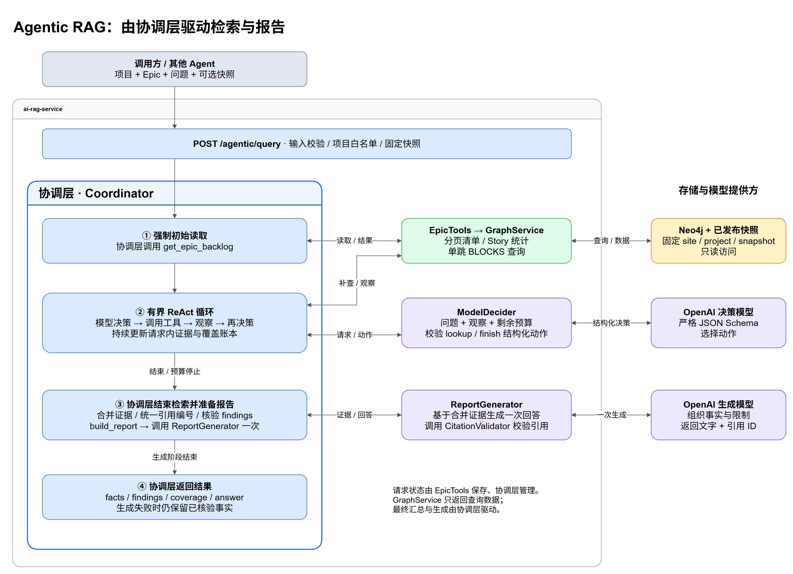

# Agentic Epic analysis POC

该能力仍属于平台级 RAG 服务：调用方传入问题和 Epic，服务返回知识分析结果。内部由一个有界 ReAct 决策循环协调检索；不是独立业务 Agent，也不需要 MCP、LangGraph 或多 Agent 框架。



[可编辑架构图](../illustrations/agentic-epic-analysis.drawio)

[English diagram](../illustrations/agentic-epic-analysis-en.png) · [English Draw.io](../illustrations/agentic-epic-analysis-en.drawio)

2026-09-21 用户确认本地测试通过。验收记录见 [实验报告](../evaluation/agentic-epic-analysis-results.md)；这不代表已经部署到 GKE。

蓝色边框明确标出协调层：它驱动初始读取、ReAct 循环、报告准备及结果返回。EpicTools 保存请求内证据与覆盖账本，生命周期由协调层管理；GraphService 返回查询数据，ReportGenerator 负责最终文字与引用校验。协调层不会让 GraphService 自行汇总或触发生成，也不会逐轮调用 GraphAnswerer 拼接独立答案。

## 如何实现

1. `POST /agentic/query` 校验主体，在配置允许的项目中解析已发布快照。首个有效结果固定整个请求的 site/project/snapshot。
2. Python `EpicTools` 强制读取 Epic 直属清单，自动分页，按 `status_category=done` 计算 Story 完成数量。Bug 不进入 Story 分母；清单不完整或没有 Story 时，完成率为 null。
3. `ModelDecider` 通过 OpenAI SDK 的严格 JSON Schema 返回分析范围及 `get_issue_dependencies` / `finish` 动作。代码校验后才执行本地 Python 工具。模型不接触数据库连接、Cypher 或可修改的项目/快照参数。
4. 每次工具观察累积到当前请求。后续决策能看到先前的关系、事实和覆盖账本。模型负责选择下一步，Python 负责预算、统计及完成状态。
5. 检索停止后，代码合并证据、一次性分配 E1/E2 等引用编号，并用确定性谓词生成 findings。`ReportGenerator` 最后调用一次模型组织文字，复用既有 `CitationValidator` 验证引用。

**不能拼接多次回答**是指不能将两篇分别编号的答案直接相加。多轮检索可以继续使用先前的证据；本实现只在检索结束时生成一次最终报告。

## 启用与调用

先按 [Graph 本地指南](jira-graph-poc-local.md) 准备 Neo4j、已发布快照和现有 OpenAI 配置，然后设置：

```dotenv
GRAPH_ENABLED=true
AGENTIC_RAG_ENABLED=true
GRAPH_DATA_DIR=./data/graph-poc
```

保持原有 `GRAPH_SITE_URL`、`GRAPH_ALLOWED_PROJECTS` 和 Neo4j 配置。决策与生成使用现有 `ANSWER_OPENAI_MODEL` 的固定版本，调用级别采用 `reasoning_effort=low`，不会更改旧接口的提示词或行为。

```http
POST /agentic/query
Content-Type: application/json

{
  "project_key": "AIPLAT",
  "epic_key": "AIPLAT-25",
  "question": "请分析 Story 完成情况、直属 Bug，并检查未完成 Story 的入向已记录阻塞，附上证据。"
}
```

可以替换为允许项目下的任意 Epic。可选 `snapshot_id` 用于复现实验；省略时只在初始读取解析 active，后续固定该版本。输入错误返回 422；不在允许范围、快照或 Epic 不存在返回 404；主体快照无法读取返回 503。后续局部故障以 200 返回已验证结果和 partial 覆盖。

开关默认关闭，关闭时路由不存在。回滚只需设置 `AGENTIC_RAG_ENABLED=false` 并重启服务，已有 `/query`、`/retrieve`、Graph API 继续工作。

## 本机已有环境：直接启动与验收

先启动 Docker Desktop，等待 Engine 就绪。在 PowerShell 中从主仓库运行当前代码，复用旧 worktree 的环境与数据：

```powershell
cd C:\SourceCode\ai-rag-service
docker compose --env-file .worktrees/jira-backlog-graph-poc/.env.graph -f .worktrees/jira-backlog-graph-poc/compose.graph.yaml up -d

@'
import os
from dotenv import load_dotenv, dotenv_values
import uvicorn

load_dotenv(".env", override=True)
graph_config = dotenv_values(".worktrees/jira-backlog-graph-poc/.env.graph")
os.environ.update({k: v for k, v in graph_config.items()
                   if k.startswith("GRAPH_") and v is not None})
os.environ.update({
    "GRAPH_ENABLED": "true",
    "AGENTIC_RAG_ENABLED": "true",
    "GRAPH_DATA_DIR": ".worktrees/jira-backlog-graph-poc/data/graph-poc",
    "ANSWER_OPENAI_MODEL": "gpt-5.5-2026-04-23",
})
uvicorn.run("app.main:app", host="127.0.0.1", port=8001)
'@ | ./.worktrees/jira-backlog-graph-poc/.venv/Scripts/python.exe -
```

只从 Graph 文件导入 `GRAPH_` 字段，避免测试 key 覆盖主 `.env` 的真实 OpenAI key。配置仅对该进程生效；Ctrl+C 停止 API。全新 clone 需要先按 Graph 本地指南准备环境和快照，这些私有文件不随 Git 提供。

打开 [Swagger](http://127.0.0.1:8001/docs)，选择 `POST /agentic/query` → Try it out：

```json
{
  "project_key": "AIPLAT",
  "epic_key": "AIPLAT-25",
  "question": "请分析 Story 完成情况、Epic 直属 Bug，并检查所有未完成 Story 的入向已记录阻塞，附上证据。",
  "snapshot_id": "f1ef094abab04f7a9a2c658839337a23"
}
```

该冻结快照的预期：3 个 Story、2 个 Done、完成率约 66.7%；直属 Bug 为 AIPLAT-47；AIPLAT-47（To Do）BLOCKS AIPLAT-31（In Progress）。正常调用应返回 `execution.status=completed`、`generation_status=supported`，三个请求分析项的 coverage 为 complete。可以更换 Epic 和问题；省略 snapshot_id 会读取当前 active，不保证仍与此历史预期一致。

## 返回值怎么理解

| 字段 | 意义 |
| --- | --- |
| `subject` / `snapshot` | 主体、固定版本和采集时间 |
| `facts` | 代码计算的统计、直属 Story/Bug、查询发现的关联 Bug |
| `requested` | 模型解释出的分析范围，独立评测会核对是否正确理解问题 |
| `findings` | 事实型结论，包含 code、statement、scope、evidence_ids 和 limitations |
| `evidence` / `citations` | 全局编号的证据，以及最终文字实际引用的来源 |
| `coverage` | completion、bugs、blockers 各自是否查全；未查、失败、截断不能作为“没有阻塞” |
| `execution` | 终止原因、逻辑工具/底层调用/数据库查询/模型调用数、耗时和可用 token 使用量 |
| `generation_status` / `answer` | 最终文字是否通过引用校验；失败时 answer=null，结构化事实仍保留 |

`finish` 仅表示停止行动。即使模型决定结束，未完成的必查起点仍会使覆盖为 partial。查询到一个有效阻塞可支持该关系存在；否定结论要求所请求范围完整且两端状态可解释。

完成状态是快照中记录的工作状态。BLOCKS 仅证明 Jira 记录了关系，不证明延期原因或实际交付影响。本阶段不提供健康度、风险评级、人员评价或进度预测。

## 固定实验预算

| 维度 | 限制 |
| --- | --- |
| 逻辑工具 | 最多 3 次，含强制初始读取及最多 2 次依赖补查 |
| 模型 | 最多 3 次决策，另有 1 次最终生成；SDK 自动重试关闭 |
| 请求时间 | 60 秒预算，检索/决策预留最后 15 秒给生成；逐调用检查剩余时间 |
| 单次模型调用 | 最多 15 秒超时，随剩余预算缩短 |
| 直属清单 | 每页 100，最多 500 项 |
| 依赖工具 | 每批最多 20 个已知起点，单跳 BLOCKS，inbound/outbound/both |
| 累积关系 | 最多 100 个关系涉及节点、1,000 条关系路径 |

HTTP/数据库使用各自超时，Python 不提供进程级强制中断保证；网络栈与关闭连接可能使端到端时间略超预算。GraphService 当前每个操作仍读取并核验项目图，批处理是有界循环，不是优化过的单次批量数据库查询。500 项和 100 节点限制控制 Agent 观察范围，不能理解为数据库只读取这些数量的记录。

## 评估复现

[实验结果与适用结论](../evaluation/agentic-epic-analysis-results.md)

[冻结问题及独立 oracle](../evaluation/agentic-epic-questions.json) 包含四个 Epic 的 12 个问题。基线提前知道问题类型，并只查必要依赖；Agent 只收到自然语言问题和工具观察，不接收 oracle。两组使用相同工具、生成器、证据规则、快照和预算。该流程使用结构化 Graph 查询，不调用 embedding；第一阶段 embedding cache 不参与本实验。提供方 prompt cache 未受本服务控制。

```powershell
python scripts/evaluate-agentic-epic.py --graph-env-file .env.graph --data-dir data/graph-poc --probe
python scripts/evaluate-agentic-epic.py --graph-env-file .env.graph --data-dir data/graph-poc --repeats 3 --workers 3
```

原始响应写入忽略提交的 `data/graph-poc/agentic-evaluation/`。每个问题每组至少三次，按重复轮交替两组先后顺序；最多三组配对任务并发，因此耗时是该测试负载下的值，不是独占运行基准。失败调用的 token 若无法获得，单独记为未知，不视为免费。

自动检查核对统计、路由、关系、覆盖和引用合法性。引用存在不等于文字在语义上完全被证据蕴含，需要逐题审阅；当前生成边界的提示约束和保守措辞过滤不能视为任意语言下的完备事实证明。

## 当前边界

- 仅分析固定可见项目快照中的 Epic 直属 Story、直属 Bug 和单跳已记录依赖；不递归分析子任务、跨项目或实时 Jira 状态。
- 目前沿用 Graph POC 的部署级项目白名单，没有用户级 Jira ACL；不得直接面向权限各异的用户开放。
- 分析范围仍由模型解释，因此覆盖账本验证的是已解释范围。模型遗漏用户子问题是评测失败，不会被账本自动发现。
- 只保存当前请求内的证据和动作，不保留跨请求对话记忆，不输出模型隐私推理。

代码入口：`app/api/agentic.py`、`app/agentic/coordinator.py`、`tools.py`、`report.py`、`model.py`。
