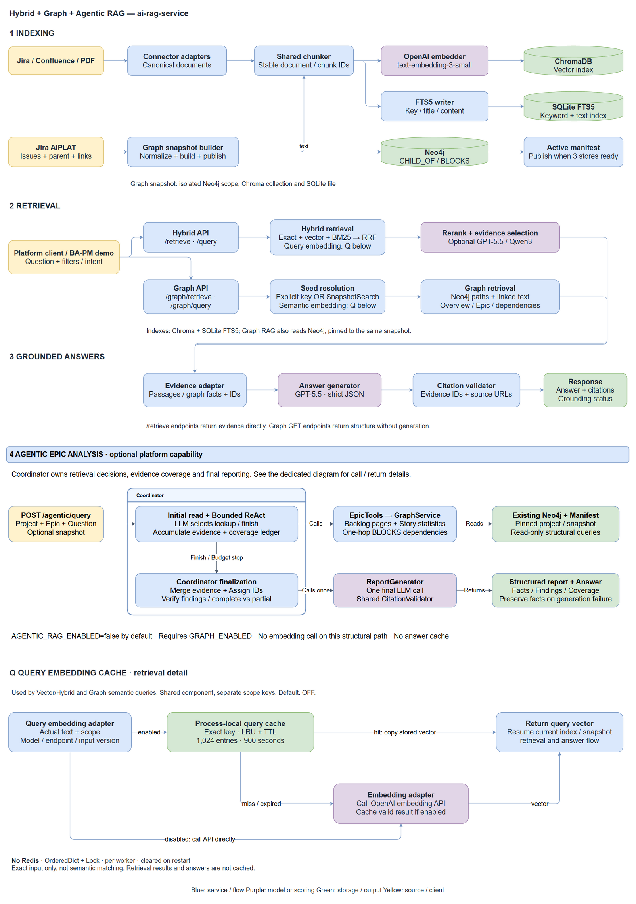

# Hybrid Retrieval and Grounded Answers PoC Design

**Date:** 2026-08-04  
**Status:** Approved design  
**Service:** AI RAG Service

## 1. Summary

This proof of concept enhances the existing FastAPI, OpenAI, and ChromaDB RAG service with:

- lexical retrieval using SQLite FTS5 and BM25;
- semantic retrieval using the existing ChromaDB embeddings;
- Reciprocal Rank Fusion (RRF) to combine lexical and semantic rankings;
- optional GPT-5 and local Qwen3 rerankers behind one interface;
- stable document, chunk, and source metadata;
- verifiable citations and evidence-aware refusal behavior; and
- an evaluation harness that measures each stage independently.

The PoC is intentionally experimental. It will compare vector-only retrieval, hybrid retrieval, GPT-5 reranking, and local Qwen3 reranking before selecting a default. PostgreSQL, pgvector, production scaling, and authorization are outside this design.

## 2. Context

The current service supports PDF, Jira, Confluence, and FX ingestion. It uses `text-embedding-3-small` embeddings in a persistent ChromaDB collection and optionally uses GPT-4o to generate an answer.

The current design has four relevant limitations:

1. Retrieval is vector-only, so exact identifiers, product names, versions, and error codes may be missed.
2. Retrieval results are not reranked using the full query and passage together.
3. Jira and Confluence connectors do not consistently preserve canonical source URLs and metadata names.
4. `/query` returns sources for the answer as a whole but does not bind individual claims to specific evidence.

The principal use cases are:

- exact factual lookup, especially Jira issue facts; and
- multi-document analysis across Jira, Confluence, and PDFs.

The target end-to-end latency for a normal generated answer is 5-10 seconds.

## 3. Goals

The PoC must:

1. Measure the current vector-only retrieval baseline.
2. Improve recall for exact identifiers and lexical matches.
3. Improve ranking quality without discarding semantic matches.
4. Compare no reranking, GPT-5 reranking, and local Qwen3 reranking.
5. Return citations that reference only retrieved, server-known evidence.
6. Refuse to answer when the selected evidence is insufficient.
7. Preserve existing `/retrieve` and `/query` request and response fields.
8. Degrade safely when one retrieval or reranking component fails.
9. Make every quality claim measurable through a repeatable evaluation set.

## 4. Non-Goals

The PoC will not:

- migrate storage to PostgreSQL or pgvector;
- support multi-replica index writes;
- implement tenant isolation, document-level authorization, or rate limiting;
- replace `text-embedding-3-small`;
- support million-scale corpora or high query concurrency;
- build an agentic retrieval loop;
- fine-tune an embedding or reranking model; or
- treat the presence of a URL as proof that an answer is grounded.

## 5. Evaluation Corpus

The initial corpus is the currently accessible test data:

| Source | Documents | Chunks with current splitter | Average chunks per document |
|---|---:|---:|---:|
| Jira project `SCRUM` | 100 | 492 | 4.9 |
| Confluence space `AITest` (space key `SCRUM`) | 50 | 314 | 6.3 |
| Test PDFs | 3 | 706 | 235.3 |
| **Total** | **153** | **1,512** | - |

The evaluation set will contain approximately 30 questions:

- 12 exact factual or Jira-key questions;
- 10 semantic or cross-document analysis questions;
- 4 hard-negative questions with similar but incorrect documents; and
- 4 unanswerable questions.

Each evaluation case will record:

```json
{
  "question": "What are the acceptance criteria for SCRUM-42?",
  "query_type": "exact_fact",
  "relevant_document_ids": ["jira:SCRUM-42"],
  "relevant_chunk_ids": ["jira:SCRUM-42:chunk:2"],
  "expected_facts": ["user ID", "event timestamp"],
  "should_abstain": false
}
```

Ground-truth chunk IDs will be assigned after the canonical chunk identity scheme is implemented. Cases may initially be labeled at document level and then refined to chunk level.

## 6. Architecture



The editable source is stored in
`assets/hybrid-grounded-rag-poc-architecture.drawio`. The PNG export also keeps
its draw.io XML embedded, so either file can be opened directly in draw.io for
future edits.

### 6.1 Indexing Flow

```text
Jira / Confluence / PDF
          |
          v
Canonical Document
          |
          v
       Chunking
          |
    +-----+------+
    |            |
    v            v
Embedding      Text fields
    |            |
    v            v
ChromaDB     SQLite FTS5
```

The shared indexer will produce chunks once and send the same stable chunk identities to both indexes. Index writes must be idempotent at the document level.

The lexical branch does not calculate BM25 relevance during ingestion. It writes
the searchable `issue_key`, `title`, and chunk `content` fields into SQLite FTS5,
where FTS5 tokenizes them and builds the inverted index. At query time, SQLite
performs keyword matching and calculates BM25 ranking using the configured field
weights (defaults: issue key `10`, title `5`, content `1`). Chroma-only data must
therefore be reingested before lexical or hybrid retrieval can find it.

### 6.2 Query Flow

```text
User query
    |
    v
Deterministic query hints
(Jira key and explicit filters)
    |
    +---------------------+
    |                     |
    v                     v
SQLite FTS5/BM25      Chroma vector search
Top 30                Top 30
    |                     |
    +----------+----------+
               |
               v
          RRF and dedupe
               |
             Top 20
               |
               v
       Optional reranker
               |
            Top 5-10
               |
       +-------+--------+
       |                |
       v                v
   /retrieve          /query
   evidence       answer + citations
```

Query analysis is deterministic in this PoC. Jira keys are recognized with a configurable regular expression. The design does not add a separate LLM query-planning call.

## 7. Canonical Data Model

Every chunk will expose the following canonical fields:

```json
{
  "document_id": "jira:SCRUM-42",
  "chunk_id": "jira:SCRUM-42:chunk:2",
  "chunk_index": 2,
  "source_type": "jira",
  "source_url": "https://example.atlassian.net/browse/SCRUM-42",
  "title": "[SCRUM-42] Login auditing",
  "content": "...",
  "metadata": {
    "issue_key": "SCRUM-42",
    "project_key": "SCRUM",
    "status": "In Progress",
    "updated_at": "2026-08-01T10:00:00Z"
  }
}
```

Identity rules are:

- Jira document: `jira:<issue-key>`
- Confluence document: `confluence:<page-id>`
- PDF document: `pdf:<stable-content-or-file-identity>`
- Chunk: `<document-id>:chunk:<zero-based-index>`

Canonical fields will be added without removing legacy metadata. In particular, existing `issue_key` and lifecycle `key` consumers remain supported while the service adopts one canonical Jira-key accessor internally.

`source_url` is created by trusted connector code. An LLM may reference an evidence ID, but it may never create or override the URL.

## 8. Retrieval Components

### 8.1 Interfaces

The query pipeline will depend on small internal interfaces:

```python
class VectorRetriever:
    def search(self, query, top_k, filters): ...

class LexicalRetriever:
    def search(self, query, top_k, filters): ...

class ResultFusion:
    def fuse(self, result_sets, top_k): ...

class Reranker:
    def rerank(self, query, candidates, top_k): ...

class EvidenceSelector:
    def select(self, query, candidates, top_k): ...
```

The PoC implementations are:

- `ChromaVectorRetriever`
- `SQLiteFTSRetriever`
- `ReciprocalRankFusion`
- `NoOpReranker`
- `GPT5Reranker`
- `Qwen3LocalReranker`

The PoC does not implement PostgreSQL adapters.

### 8.2 Lexical Retrieval

SQLite FTS5 will index, at minimum:

- `chunk_id` as an unindexed identity column;
- `document_id` and `source_type` for result mapping;
- `issue_key`;
- `title`; and
- `content`.

Field weights will favor exact identifiers and titles over body content. Initial weights are configuration values rather than fixed API behavior. Their defaults will be documented and tuned only against the evaluation set.

The FTS database will be persisted separately from ChromaDB. Deletes and document upserts must remove all previous chunk rows before inserting the new version.

### 8.3 Semantic Retrieval

The semantic path retains:

- OpenAI `text-embedding-3-small`;
- ChromaDB cosine distance;
- configurable top-k retrieval; and
- existing metadata filtering.

Exact Jira-key lookup is performed as a deterministic path in addition to lexical and vector retrieval. Exact results participate in deduplication and evidence selection using the same result schema.

### 8.4 Reciprocal Rank Fusion

BM25 and vector scores are not directly comparable. RRF combines ranks rather than raw scores:

```text
RRF(document) = sum(1 / (k + rank_i))
```

The initial constant is `k = 60`. The lexical and vector paths each return up to 30 candidates. RRF deduplicates by `chunk_id` and returns up to 20 candidates for reranking or final selection.

Exact-match results receive a deterministic priority signal separate from raw BM25 or vector scores. The exact-match rule and its effect on final ordering must be visible in retrieval diagnostics.

## 9. Reranking Experiments

Reranking is optional and must fail open to the RRF ordering.

### 9.1 No-Op Baseline

`NoOpReranker` preserves the RRF order. It establishes whether hybrid retrieval alone provides sufficient quality.

### 9.2 GPT-5 Reranker

The GPT-5 implementation is a listwise reranker. It receives the query and up to 20 delimited, untrusted candidate passages in one request. It returns only candidate chunk IDs and discrete relevance grades:

- `0`: irrelevant;
- `1`: topically related but does not support an answer;
- `2`: partially supports an answer; and
- `3`: directly supports an answer.

The response uses a strict JSON schema. The service rejects unknown or duplicated chunk IDs. The model cannot provide source URLs or invoke tools.

The model ID is configurable and pinned for repeatable evaluation. A timeout, malformed response, or API error returns the unchanged RRF order.

### 9.3 Local Qwen3 Reranker

The local experiment uses `Qwen/Qwen3-Reranker-0.6B`. It scores query-passage pairs in batches and returns the candidates in descending relevance order.

Operational constraints are:

- the model is loaded once per application process;
- the model revision is pinned;
- candidate count defaults to 20;
- input length and batch size are bounded;
- inference has a timeout or circuit-breaker boundary; and
- failures return the unchanged RRF order.

The local relevance score is a ranking signal, not a calibrated probability of answer correctness.

### 9.4 Selection Rule

The PoC does not assume that either reranker is required. A reranker becomes the default only if it produces a material evaluation improvement while remaining inside the latency budget. Otherwise, RRF remains the default.

## 10. Evidence Selection and Confidence

The service will not use one arbitrary vector threshold as a universal confidence score. Vector similarity, BM25 rank, RRF score, and reranker score have different meanings.

The evidence selector considers:

- exact Jira-key or metadata matches;
- reranker relevance, when available;
- whether at least one passage directly supports the question;
- duplicate or near-duplicate chunks from one document;
- source diversity for cross-document questions; and
- thresholds calibrated from the evaluation set.

Initial thresholds are disabled until baseline score distributions have been recorded. A threshold may be enabled only with a documented evaluation result showing its effect on answerable and unanswerable cases.

When evidence is insufficient, `/query` returns the existing refusal text and no citations.

## 11. Grounded Answer Design

### 11.1 Evidence Contract

Selected passages receive server-assigned evidence IDs:

```text
[E1]
chunk_id: jira:SCRUM-42:chunk:2
content: ...

[E2]
chunk_id: confluence:123:chunk:1
content: ...
```

The generation prompt requires every material factual claim to cite one or more evidence IDs. If the evidence does not support an answer, the model must refuse.

### 11.2 Citation Validation

The generation model returns an answer plus citation references. The service then:

1. verifies that each evidence ID exists in the supplied evidence set;
2. maps the evidence ID to trusted `document_id`, `chunk_id`, and `source_url` values;
3. rejects invented IDs and URLs;
4. includes a bounded excerpt from the cited chunk; and
5. records whether citation structure is valid.

Structural validity does not prove semantic support. Citation correctness is measured against the evaluation set. The API will not set `grounded: true` merely because valid-looking citations exist.

### 11.3 Grounding Status

The additive grounding object supports these statuses:

- `supported`: selected evidence is sufficient and all citations are structurally valid;
- `partially_supported`: an answer was produced, but one or more material claims lack valid evidence references;
- `insufficient_evidence`: the service refused because evidence was inadequate; and
- `validation_failed`: model output could not be safely mapped to supplied evidence.

For the PoC, `supported` means evidence selection passed and citation structure is valid. It remains an operational signal, not a formal proof of truth. Semantic citation correctness is reported by the offline evaluation.

## 12. Backward-Compatible API Changes

### 12.1 `/retrieve`

Existing request and response fields remain unchanged. Each result may add:

```json
{
  "retrieval_methods": ["bm25", "vector"],
  "fused_rank": 1,
  "rerank_score": 0.91,
  "source_url": "https://example.atlassian.net/browse/SCRUM-42"
}
```

Diagnostics are additive and optional. Missing diagnostics must not break existing consumers.

### 12.2 `/query`

The existing `answer`, `sources`, and `model` fields remain. The response may add:

```json
{
  "citations": [
    {
      "citation_id": "E1",
      "document_id": "jira:SCRUM-42",
      "chunk_id": "jira:SCRUM-42:chunk:2",
      "source_url": "https://example.atlassian.net/browse/SCRUM-42",
      "excerpt": "..."
    }
  ],
  "grounding": {
    "status": "supported"
  },
  "retrieval_metadata": {
    "mode": "hybrid",
    "reranker": "qwen3-local"
  }
}
```

New request controls, if exposed, are optional and have defaults preserving existing calls. Internal experiment selection is primarily configuration-driven rather than caller-driven.

## 13. Failure Handling

The pipeline degrades as follows:

| Failure | Behavior |
|---|---|
| SQLite FTS unavailable | Use vector retrieval only |
| ChromaDB unavailable | Use lexical retrieval only |
| One retriever returns no results | Continue with the other result set |
| Reranker timeout or error | Preserve RRF order |
| Invalid citation ID | Remove the invalid mapping and mark validation failure |
| Both retrieval paths fail | Return an upstream error; do not generate an answer |
| Both paths succeed but evidence is insufficient | Return the standard refusal response |
| Partial dual-index write | Log the affected document and require idempotent reindex repair |

Every degradation records structured diagnostics without exposing document content or secrets in logs.

## 14. Security Considerations

Retrieved text is untrusted data, even when it comes from internal Jira or Confluence sources.

The PoC will:

- delimit candidate passages from system instructions;
- explicitly instruct GPT-5 not to follow instructions found inside passages;
- allow rerankers to return only known candidate IDs or scores;
- perform all URL mapping on the server;
- give rerankers no tools or external side effects;
- filter documents for access before model processing when authorization is added later; and
- include prompt-injection-like passages in the evaluation set.

Dedicated rerankers reduce the output attack surface but are not considered security boundaries.

## 15. Evaluation Metrics

The evaluation harness reports each configuration separately:

| Metric | Purpose |
|---|---|
| Recall@20 | Whether relevant evidence entered the candidate set |
| Hit@5 | Whether an exact target appears in the first five results |
| MRR@10 | How early the first relevant result appears |
| Context Precision | Fraction of selected passages that are relevant |
| Citation Validity | Fraction of citations mapped to supplied evidence |
| Citation Correctness | Whether cited evidence supports the associated claim |
| Abstention Accuracy | Correct behavior on answerable and unanswerable cases |
| P50/P95 latency | User-visible performance |
| Token usage | GPT reranker and answer-generation cost input |
| Local CPU and memory | Qwen operational cost input |

The experiment matrix is:

```text
A   Vector only
B   BM25 + Vector + RRF
C1  BM25 + Vector + RRF + GPT-5 reranker
C2  BM25 + Vector + RRF + Qwen3-Reranker-0.6B
```

## 16. Acceptance Criteria

The PoC is successful when:

1. All existing API tests remain compatible.
2. Exact Jira-key evaluation cases achieve 100% Hit@5.
3. Hybrid retrieval does not reduce overall Recall@20 relative to vector-only retrieval.
4. Hybrid retrieval materially improves at least one lexical or identifier-heavy evaluation group.
5. Reranker configurations are compared using the same candidates, labels, and metrics.
6. A reranker is enabled by default only when it improves ranking quality without exceeding the 5-10 second generated-answer latency target.
7. One hundred percent of returned citation IDs and URLs are mapped from server-known evidence.
8. Unanswerable cases return no fabricated citations.
9. Failure-path tests demonstrate the documented vector-only, lexical-only, and no-reranker fallbacks.
10. The final evaluation report states which configuration is recommended and why.

"Material improvement" for reranker selection means a repeatable gain on MRR@10 or Context Precision with no regression in Recall@20. Because the initial evaluation set is small, the report must show per-question changes in addition to aggregate metrics rather than relying on a statistical-significance claim.

## 17. Configuration

The design expects configuration values for:

- lexical index path;
- lexical and vector candidate counts;
- RRF `k`;
- final evidence count;
- retrieval mode;
- reranker provider (`none`, `openai`, or `qwen_local`);
- OpenAI reranker model and timeout;
- local model name, pinned revision, batch size, maximum input length, and timeout; and
- thresholds enabled only after evaluation calibration.

Defaults preserve current requests and make failures fall back to the least expensive available retrieval path.

## 18. Design Decision Summary

- Use SQLite FTS5/BM25 for the PoC lexical index.
- Keep ChromaDB and `text-embedding-3-small` for semantic retrieval.
- Fuse lexical and vector ranks with RRF instead of combining raw scores.
- Recognize Jira keys deterministically.
- Compare RRF-only, GPT-5, and local Qwen3 reranking.
- Treat reranker output as ranking evidence, not answer confidence.
- Create citations from stable server-owned chunk identities and URLs.
- Calibrate refusal thresholds from the evaluation set.
- Preserve existing API fields and add new fields only.
- Defer PostgreSQL and pgvector to a future production design.

## 19. Deferred Production Follow-ups

Exact Jira-key lookup does not short-circuit the PoC retrieval pipeline. Keyword
and embedding retrieval still run, exact candidates join them in RRF, and exact
matches are prioritized before the default no-op reranker. This preserves useful
related context while keeping the PoC behavior simple.

If production evaluation shows unnecessary latency or an enabled reranker can
demote an exact result, consider either short-circuiting simple exact-key queries
or pinning exact matches ahead of reranking the remaining candidates. These are
production optimizations and are intentionally outside the PoC scope.
